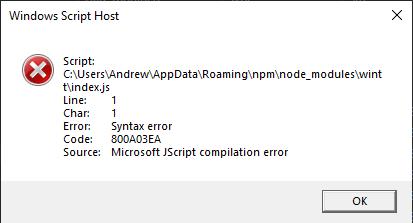

<p align="center">
    
</p>
<h1 align="center"><b>wtt</b></h1>
<h3 align="center">A cli for Windows Terminal</h3>

<h5>Notice ‼ This CLI isn't fully completed yet and some features are missing. The project is functional for the main purpose (installing themes)</h5>

## Abstract
wtt is a command line interface written in Node.js to add more utility to the Windows Terminal application such as *theme installing*, *configuration file backups*, and more to come in the future.

---

## Setup Process
There are two methods, from the NPM package manager or locally as a standalone folder.

### NPM
> ``npm install wintt``

Run wtt with ``npx wintt``

### Locally
Clone the repository
> ``git clone https://github.com/rainwashed/wtt.git`` 

Install the dependencies
> ``npm install``

Run wtt with ``node index.js``

---

## Common Issues

### **Windows Script Host**
If during ``npx wintt``, you encounter an issue like this:



there is no need to worry. Just head to ``C:\Users\[system username]\AppData\Roaming\npm\node_modules\wintt``, find the ``index.js`` file, right click it, and press **Open With -> Choose another app -> More -> Look for another item on this PC** and locate the Node.js runtime (typically located at ``C:\Program Files\nodejs\node.exe``)

### **themeData returned invalid.**
If you encounter an issue that says **themeData returned invalid**:


just use the corresponding theme index number instead of the theme name (ex 3024 Day -> 0)

---

## Documentation
wtt has 6 core commands, and those are as follows.
- list
- install
- backup
- upload
- download
- clean

The syntax for wtt is \
```wtt <main_command> --flags -params=value [...arguments]```

The ``main_command`` must be either ``["list", "install", "backup", "upload", "download", "clean", "about", "credits", "help"]`` \
``--flags`` are to be assumed as options that go from false ❌ to true ✅ unless otherwise stated

``Flags`` and ``params`` can be in any order (ie before the main_command or after), but ``arguments`` must follow the ``main_command``

#### **List**
List theme schemes or details about a specific theme
    
> Arguments: Theme name or index number \
> Valid Parameters: None \
> Valid Flags: None

#### **Install**
Install a theme schema

> Arguments: Theme name or index number \
> Valid Parameters: None \
> Valid Flags: None

> For theme names that contain a space, replace the space with a + \
> (ex: 3024 Day -> 3024+Day)

> or optionally use the theme index number \
> (ex: 3024 Day -> 0)

#### **Backup**
Backup the Windows Terminal configuration file to a local location (default: C:/Users/systemUsername/Documents/wtt)

> Arguments: None \
> Valid Parameters: None \
> Valid Flags: None

#### **Upload**
Upload the Windows Terminal configuration file to a GitHub repository

> Arguments: None \
> Valid Parameters: None \
> Valid Flags: None

#### **Download**
Download the Windows Terminal configuration file from the GitHub repository

> Arguments: None \
> Valid Parameters: None \
> Valid Flags: None

#### **Clean**
Reset the Windows Terminal configuration file to the original (the default backup when first running wtt backup)

> Arguments: None \
> Valid Parameters: None \
> Valid Flags: None

### Minor Commands

#### **About**
List system information and wtt information such as version, configuration file, valid backups, etc.

> Arguments: None \
> Valid Parameters: None \
> Valid Flags: None

#### **Credits**
List authors, contributors, dependencies, and other information regarding the project

> Arguments: None \
> Valid Parameters: None \
> Valid Flags: None

#### **help**
Show documentation on a specific command or show this screen

> Arguments: command \
> Valid Parameters: None \
> Valid Flags: None

---

## License
This project is under the **GNU General Public License v3** and can be viewed in the [LICENSE](./LICENSE) file.